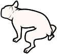

# Dog's Business

Track and share where your dog did her/his business; i.e., 💦 and 💩.

Enjoy it and **CLEAN UP AFTER YOUR DOG.**

Powered by [Mapbox](https://www.mapbox.com).

## Usage scenarios

Please refer to [scenarios.md](scenarios.md).

## Database

Please refer to [database.md](database.md).

## Account management

### Offline account

All data are persisted only in [IndexedDB](https://developer.mozilla.org/en-US/docs/Web/API/IndexedDB_API).

Pros
- No privacy concerns since no data are uploaded to the server.

Cons
- Data may be lost when the browser cache is deleted.
- Data cannot be transferred to another device.

### Online device account

Selected data are uploaded to and persisted in the server.
A user is identified by a user device key that is an RSA public key generated by user's device.
The private key is stored in [IndexedDB](https://developer.mozilla.org/en-US/docs/Web/API/IndexedDB_API).

Pros
- Data may be transferred to another device as long as the private key is available.
- A user do not need to provide an email address to the server.

Cons
- Data may be lost when the browser cache is deleted.

### Online personal account

Selected data are uploaded to and persisted in the server.
A user is identified by her/his email address or Google account ID.

Pros
- Data may be transferred to another device as long as the user is identified.
- Data may be recovered from the server as long as the user is identified.

Cons
- A user need to provide an email address to the server.

## Fonts

- Title
    - [Montserrat](https://fonts.google.com/specimen/Montserrat?sidebar.open=true&query=montse)
    - TBD: [Kosugi Maru (ja)](https://fonts.google.com/specimen/Kosugi+Maru?sidebar.open=true&query=kosugi#pairings)
- Body
    - [Open Sans](https://fonts.google.com/specimen/Open+Sans?sidebar.open=true&query=open)
    - [Noto Sans JP (ja)](https://fonts.google.com/specimen/Noto+Sans+JP?sidebar.open=true&subset=japanese)
- Icons
    - [Material Design Icons](https://materialdesignicons.com)